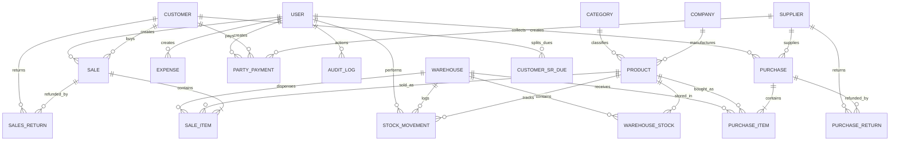

# 🏢 M.R. Enterprise - Inventory Management System (Backend API)

[](https://nodejs.org/)
[](https://expressjs.com/)
[](https://www.typescriptlang.org/)
[](https://www.prisma.io/)
[](https://neon.tech/)
[](https://vercel.com/)

> **Language / ভাষা নির্বাচন:**  
> 🇺🇸 **English Version (Default)** | [🇧🇩 বাংলা সংস্করণে যেতে নিচে স্ক্রোল করুন বা ক্লিক করুন](#-বাংলা-ডকুমেন্টেশন)

---

## 📑 Table of Contents (English)
1. [Project Overview](#-project-overview)
2. [Key Capabilities & Modules](#-key-capabilities--modules)
3. [Architecture & System Design](#-architecture--system-design)
4. [Tech Stack](#-tech-stack)
5. [Database Schema & Entity Relationships](#-database-schema--entity-relationships)
6. [REST API Endpoints Specification](#-rest-api-endpoints-specification)
7. [Environment Variables](#-environment-variables)
8. [Getting Started & Local Development](#-getting-started--local-development)
9. [Database Migrations, Seeding & Backups](#-database-migrations-seeding--backups)
10. [Automated Testing](#-automated-testing)
11. [Deployment Architecture (Vercel + Neon)](#-deployment-architecture-vercel--neon)
12. [Security & Best Practices](#-security--best-practices)

---

## 🌟 Project Overview

The **M.R. Enterprise Inventory Management System Backend** is an enterprise-grade RESTful API built to handle the complex end-to-end operational demands of wholesale and retail distribution enterprises. Designed with strict transactional integrity, role-based security, and real-time auditability, this service orchestrates inventory warehousing, point-of-sale and invoice billing, supplier purchases, returns management, party dues ledgers, and advanced inventory velocity analytics.

### Core Business Domains Handled:
- **Warehouse Logistics:** Multi-warehouse stock tracking, inter-warehouse movements, and manual stock reconciliations.
- **Supply Chain & Purchases:** Cash and credit purchase invoicing, automated vendor ledger synchronization, and carton-to-piece pack conversions.
- **Sales & Point of Sale (POS):** Fast barcode scanning checkout, manual order invoice creation, discount processing, and real-time gross profit calculation.
- **Financial Ledgers & Collections:** Double-entry-style customer and supplier dues tracking, SR (Sales Representative) groupings, and multi-channel payment collection (Cash, Bank, bKash, Nagad, Cheque).
- **Executive Analytics & Stock Aging:** Granular stock aging brackets (e.g., 0-30, 31-60, 61-90, 90+ days), fast vs. slow vs. dead-stock velocity analysis, low-stock reorder warnings, and Month-over-Month (MoM) comparisons.

---

## 🧩 Key Capabilities & Modules

The backend is structured into **17 decoupled functional modules**:

| Module | Location | Purpose & Functionality |
| :--- | :--- | :--- |
| **Auth** | `src/modules/auth` | JWT token issuance, verification, password hashing, and user identity profile inspection. |
| **Users** | `src/modules/users` | Multi-tier RBAC (`SUPER_ADMIN`, `ADMIN`, `MANAGER`), user status lifecycles (`PENDING`, `ACTIVE`, `REJECTED`, `INACTIVE`), and warehouse bindings. |
| **Warehouses** | `src/modules/warehouses` | Multiple physical warehouse and stockroom locations, default warehouse designation, and status control. |
| **Companies** | `src/modules/companies` | Manufacturer and brand registrations associated with product catalogs. |
| **Categories** | `src/modules/categories` | Hierarchical catalog classification for reporting and filtering. |
| **Products** | `src/modules/products` | Master product catalog, SKU/Barcode unique management, DP (Dealer Price) rate, Commission %, Cost Price, Selling Price, and pack-size conversions. |
| **Inventory** | `src/modules/inventory` | Stock adjustments (`RESTOCK`, `DAMAGE`, `LOSS`, `CORRECTION`), warehouse stock transfers, and real-time balance inquiries. |
| **Sales** | `src/modules/sales` | Transactional sales orders, barcode point of sale, line item allocations, profit calculation per item, and invoice generation. |
| **Purchases** | `src/modules/purchases` | Vendor purchase orders, carton pack size loose item calculations, purchase cost adjustments, and supplier ledger dues updates. |
| **Returns** | `src/modules/returns` | Sales Returns and Purchase Returns, restock handling, and financial refunds (Cash or Party Credit Adjustment). |
| **Parties** | `src/modules/parties` | Customer and Supplier management, opening dues, credit limits, phone lookups, and SR (Sales Representative) dues segregation. |
| **Payments** | `src/modules/payments` | Payment vouchers for Customer Collections and Supplier Payments across Cash, Bank, bKash, Nagad, and Cheque. |
| **Expenses** | `src/modules/expenses` | Operational expense tracking categorized by utilities, rents, salaries, logistics, and office costs. |
| **Reports** | `src/modules/reports` | Stock Aging analysis, Low Stock & Reorder Alerts, Product Velocity (Fast/Slow/Dead stock), Sales Summaries, Profit/Loss, and Party Ledgers. |
| **Dashboard** | `src/modules/dashboard` | Real-time executive metrics: Today's sales, revenue, gross profit, inventory valuation, and pending alert counters. |
| **Audit Logs** | `src/modules/audit` | Comprehensive audit trail logging every administrative modification with actor ID, entity reference, timestamp, and JSON metadata. |
| **Settings** | `src/modules/settings` | Store configuration, business details, proprietor name, address, and invoice memo footer notes. |

---

## 🏗 Architecture & System Design

The application follows a clean layered architecture ensuring strict separation of concerns:

```
                  ┌───────────────────────────────┐
                  │    HTTP Request / Client      │
                  └───────────────┬───────────────┘
                                  │
                                  ▼
                  ┌───────────────────────────────┐
                  │   Helmet / CORS / JSON Parser │
                  └───────────────┬───────────────┘
                                  │
                                  ▼
                  ┌───────────────────────────────┐
                  │  Auth Middleware (JWT & RBAC) │
                  └───────────────┬───────────────┘
                                  │
                                  ▼
                  ┌───────────────────────────────┐
                  │     Zod Validation Layer      │
                  └───────────────┬───────────────┘
                                  │
                                  ▼
                  ┌───────────────────────────────┐
                  │       Module Controllers      │
                  └───────────────┬───────────────┘
                                  │
                                  ▼
                  ┌───────────────────────────────┐
                  │    Business Logic Services    │
                  │   (Prisma ACID Transactions)  │
                  └───────────────┬───────────────┘
                                  │
                                  ▼
                  ┌───────────────────────────────┐
                  │  PostgreSQL Database (Neon)   │
                  └───────────────────────────────┘
```

---

## 💻 Tech Stack

- **Runtime Environment:** [Node.js](https://nodejs.org/) (v20.x or v22.x recommended)
- **Framework:** [Express.js](https://expressjs.com/) v4.21.1
- **Programming Language:** [TypeScript](https://www.typescriptlang.org/) v5.6.3
- **Object-Relational Mapping (ORM):** [Prisma ORM](https://www.prisma.io/) v5.22.0
- **Database Engine:** [PostgreSQL](https://www.postgresql.org/) (Hosted on [Neon Serverless Postgres](https://neon.tech/))
- **Data Validation:** [Zod](https://zod.dev/) v3.23.8
- **Authentication & Cryptography:** [JSON Web Token (JWT)](https://jwt.io/) & [Bcryptjs](https://www.npmjs.com/package/bcryptjs)
- **Security & Headers:** [Helmet](https://helmetjs.github.io/) & [CORS](https://www.npmjs.com/package/cors)
- **Testing Suite:** [Vitest](https://vitest.dev/) & [Supertest](https://github.com/ladjs/supertest)
- **Development Tooling:** `tsx` (TypeScript Execution watch mode)
- **Deployment Platform:** [Vercel](https://vercel.com/) (Serverless Express Functions with rewrite configuration)

---

## 🗄 Database Schema & Entity Relationships

The relational schema is configured with 17 interconnected Prisma models with precise indexing and cascade rules.



### Key Numerical & Decimal Constraints:
- Financial columns (`totalAmount`, `costPrice`, `sellingPrice`, `profit`, `openingDue`, `currentDue`) utilize `@db.Decimal(12, 2)` to eliminate floating-point calculation errors.
- Inventory quantity columns (`quantity`, `reorderLevel`, `packSize`, `looseQuantity`) utilize `@db.Decimal(12, 3)` supporting fractional/metric units of measurement.

---

## 🚀 REST API Endpoints Specification

All API routes are prefixed with `/api`. Protected routes require a Bearer token in the `Authorization` header: `Authorization: Bearer <TOKEN>`.

### 1. Authentication (`/api/auth`)
- `POST /api/auth/login` — Authenticate user and receive JWT access token.
- `GET /api/auth/me` — Inspect current authenticated user profile and roles.
- `POST /api/auth/change-password` — Change password for authenticated session.

### 2. User Management (`/api/users`)
- `GET /api/users` — List all registered users (Searchable by role, status, email).
- `POST /api/users` — Create new administrative or manager user.
- `GET /api/users/:id` — Get detailed user profile.
- `PUT /api/users/:id` — Update user details, role, or warehouse assignment.
- `PATCH /api/users/:id/status` — Approve or change status (`ACTIVE`, `INACTIVE`, `REJECTED`).
- `DELETE /api/users/:id` — Delete user account.

### 3. Warehouses (`/api/warehouses`)
- `GET /api/warehouses` — List all warehouse locations with stock count summaries.
- `POST /api/warehouses` — Register a new physical warehouse.
- `GET /api/warehouses/:id` — Retrieve warehouse details.
- `PUT /api/warehouses/:id` — Update warehouse name, address, code, or default flag.
- `DELETE /api/warehouses/:id` — Deactivate or remove warehouse.

### 4. Catalog: Categories & Companies (`/api/categories`, `/api/companies`)
- `GET /api/categories`, `POST /api/categories`, `PUT /api/categories/:id`, `DELETE /api/categories/:id`
- `GET /api/companies`, `POST /api/companies`, `PUT /api/companies/:id`, `DELETE /api/companies/:id`

### 5. Products (`/api/products`)
- `GET /api/products` — List catalog products with pagination, category filter, company filter, and low-stock filter.
- `POST /api/products` — Create new product (Unique SKU, Barcode, DP Rate, Pack Size).
- `GET /api/products/:id` — Get product details and total stock across all warehouses.
- `GET /api/products/barcode/:barcode` — Fast lookup for POS barcode scanner.
- `PUT /api/products/:id` — Update product metadata and pricing structures.
- `DELETE /api/products/:id` — Soft-delete / deactivate product.

### 6. Inventory Operations (`/api/inventory`)
- `GET /api/inventory` — View current stock levels per warehouse and product.
- `POST /api/inventory/adjustment` — Record manual stock adjustment (`DAMAGE`, `RESTOCK`, `LOSS`, `CORRECTION`).
- `POST /api/inventory/transfer` — Transfer stock between source and destination warehouses.
- `GET /api/inventory/movements` — Query granular stock movement history logs with filters.

### 7. Sales & Point of Sale (`/api/sales`)
- `GET /api/sales` — List all sales invoices (Filterable by date range, customer, payment status).
- `POST /api/sales` — Create sales invoice (Calculates profit, auto-deducts warehouse stock, syncs customer dues).
- `GET /api/sales/:id` — Fetch complete invoice breakdown with line items.
- `POST /api/sales/:id/cancel` — Cancel sale, restore warehouse stock, and reverse customer dues balance.

### 8. Purchases (`/api/purchases`)
- `GET /api/purchases` — List vendor purchase transactions.
- `POST /api/purchases` — Record vendor purchase (Restocks inventory, calculates item purchase rates, updates vendor dues).
- `GET /api/purchases/:id` — Fetch purchase invoice breakdown.

### 9. Returns (`/api/returns`)
- `POST /api/returns/sales` — Process customer sales return (Return stock to warehouse, issue cash refund or credit adjustment).
- `POST /api/returns/purchases` — Process supplier return (Deduct stock, adjust supplier dues).
- `GET /api/returns/sales`, `GET /api/returns/purchases` — List return transaction history.

### 10. Parties & Ledgers (`/api/parties`)
- `GET /api/parties/customers`, `POST /api/parties/customers`, `PUT /api/parties/customers/:id`
- `GET /api/parties/suppliers`, `POST /api/parties/suppliers`, `PUT /api/parties/suppliers/:id`
- `GET /api/parties/customers/:id/ledger` — Full transactional statement of customer invoices and collections.
- `GET /api/parties/suppliers/:id/ledger` — Full transactional statement of supplier bills and payments.

### 11. Payments & Collections (`/api/payments`)
- `GET /api/payments` — View list of payment vouchers.
- `POST /api/payments/customer-collection` — Collect payment from customer, reducing due balance.
- `POST /api/payments/supplier-payment` — Disburse payment to supplier, reducing payable balance.
- `GET /api/payments/:id` — View receipt voucher details.

### 12. Expenses (`/api/expenses`)
- `GET /api/expenses` — List operational expenditures with category & date filters.
- `POST /api/expenses` — Record expense entry.
- `DELETE /api/expenses/:id` — Delete expense entry.

### 13. Advanced Analytics & Reports (`/api/reports`)
- `GET /api/reports/dashboard` — High-level summary KPI counters.
- `GET /api/reports/sales-summary` — Aggregated sales and profit performance over time.
- `GET /api/reports/stock-aging` — Stock aging breakdown with configurable day brackets (`day1`, `day2`, `day3`, etc.).
- `GET /api/reports/product-velocity` — Categorizes products into Fast-Moving, Moderate, Slow-Moving, and Dead Stock.
- `GET /api/reports/reorder-alerts` — Low stock alerts with calculated suggested reorder quantities.
- `GET /api/reports/inventory-summary` — Total valuation of current inventory at cost vs. sale prices.

### 14. Settings & Audit Logs (`/api/settings`, `/api/audit-logs`)
- `GET /api/settings`, `PUT /api/settings` — Update business name, address, contact, and memo footer.
- `GET /api/audit-logs` — Administrative activity log query with entity filters.

---

## 🔐 Environment Variables

Create a `.env` file in the root of the `backend` directory:

```env
# Server Configuration
PORT=5000
NODE_ENV=development

# Database Connection (Neon PostgreSQL)
DATABASE_URL="postgresql://<USER>:<PASSWORD>@<HOST>/<DATABASE>?sslmode=require&schema=public"

# Security & Tokens
JWT_SECRET="super-secret-jwt-key-min-32-characters-long"
JWT_EXPIRES_IN="7d"

# Allowed Frontend Origins (CORS)
FRONTEND_URL="http://localhost:3000"

# Initial Super Admin Seed Credentials
SUPER_ADMIN_NAME="Super Admin"
SUPER_ADMIN_EMAIL="admin@inventory.local"
SUPER_ADMIN_PASSWORD="SuperAdminInitialPassword123!"
```

---

## 🛠 Getting Started & Local Development

### Prerequisites:
- **Node.js:** v20.x or v22.x
- **PostgreSQL:** Local database instance OR a free cloud database on [Neon.tech](https://neon.tech).

### Installation Steps:
```bash
# 1. Navigate to the backend directory
cd backend

# 2. Install all dependencies
npm install

# 3. Synchronize database schema with Prisma
npx prisma db push

# 4. Seed initial Super Admin account
npm run seed

# 5. Start development server with live reload
npm run dev
```

The backend server will launch at: `http://localhost:5000`  
Health check endpoint: `http://localhost:5000/api/health`

---

## 💾 Database Migrations, Seeding & Backups

| Command | Action |
| :--- | :--- |
| `npm run prisma:push` | Synchronizes `schema.prisma` directly to the target database without data loss. |
| `npm run prisma:generate` | Rebuilds the `@prisma/client` TypeScript typings. |
| `npm run seed` | Seeds default Super Admin if not already existing. |
| `npm run db:dump` | Exports full database records into a JSON dump file. |
| `npm run db:restore` | Restores records from a JSON dump file into the database. |

---

## 🧪 Automated Testing

The backend includes test coverage powered by **Vitest** and **Supertest**:

```bash
# Run automated test suites
npm run test
```

---

## 🌐 Deployment Architecture (Vercel + Neon)

The backend is configured for zero-downtime serverless deployments on **Vercel** with connection-pooled **Neon PostgreSQL**:

### 1. Dual Environment Branching Workflow:
- **`main` Branch (Production):**
  - Live Endpoint: `https://inventory-backend-production-main.vercel.app`
  - Connected Database: Production Neon DB instance (`DATABASE_URL_PRODUCTION_MAIN`)
  - Target Audience: Live enterprise operations and real clients.
- **`dev` Branch (Staging / Preview):**
  - Live Endpoint: `https://inventory-backend-dev.vercel.app`
  - Connected Database: Dev Neon DB instance (`DATABASE_URL_PRODUCTION_DEV`)
  - Target Audience: Feature testing, pull request validation, and QA verification.

### 2. Vercel Serverless Configuration (`vercel.json`):
```json
{
  "version": 2,
  "rewrites": [
    {
      "source": "/(.*)",
      "destination": "/api"
    }
  ]
}
```
All incoming requests are redirected to `api/index.ts`, executing the Express app within an edge-optimized serverless container.

---

## 🛡 Security & Best Practices

1. **Helmet HTTP Headers:** Protects against Cross-Site Scripting (XSS), clickjacking, and MIME-type sniffing.
2. **CORS Control:** Dynamically validates client request origins against approved frontend domains and Vercel preview URLs.
3. **Zod Schema Validation:** Enforces strict payload validation on all incoming mutations before reaching controllers.
4. **ACID Transactions:** Financial and stock calculations run within `prisma.$transaction()` blocks to prevent partial balance updates or race conditions.
5. **Secure Authentication:** Passwords are hashed using salted Bcrypt (`10` rounds), and JWTs are cryptographically signed.

---

<br/>

## 🇧🇩 বাংলা ডকুমেন্টেশন (Bengali Documentation)

<details>
<summary><b>👉 সম্পূর্ণ বাংলা সংস্করণ পড়তে এখানে ক্লিক করুন / Click here to read in Bengali</b></summary>

<br/>

# 🏢 এম.আর. এন্টারপ্রাইজ - ইনভেন্টরি ম্যানেজমেন্ট সিস্টেম (ব্যাকএন্ড এপিআই)

এম.আর. এন্টারপ্রাইজ ইনভেন্টরি ম্যানেজমেন্ট ব্যাকএন্ড হলো একটি আধুনিক, স্কেলেবল এবং এন্টারপ্রাইজ-গ্রেড RESTful API। এটি পাইকারি ও খুচরা প্রতিষ্ঠানের সম্পূর্ণ ইনভেন্টরি ওয়্যারহাউস, সেলস ইনভয়েস, বারকোড পিওএস, সাপ্লায়ার ক্রয়, সেলস/পারচেজ রিটার্ন, কাস্টমার ও সাপ্লায়ারদের বাকি-বকেয়া হিসাব (Ledger), খরচ এবং এডভান্সড স্টক এনালাইটিক্স দক্ষতার সাথে পরিচালনা করে।

---

### 📌 প্রধান মডিউল ও ফিচারসমূহ:

1. **মাল্টি-ওয়্যারহাউস স্টক ট্র্যাকিং:** একাধিক গুদাম বা ওয়্যারহাউসের স্টক নিয়ন্ত্রণ, গুদামের মধ্যে পণ্য স্থানান্তর এবং স্টক সমন্বয় (Adjustment)।
2. **পণ্য ক্যাটালগ ও মূল্য নির্ধারণ:** অনন্য SKU ও বারকোড জেনারেশন, ডিলার প্রাইস (DP Rate), কমিশন %, ক্রয় মূল্য (Cost Price), বিক্রয় মূল্য (Selling Price) এবং কার্টন ও পিস (Pack size & Loose quantity) হিসাব।
3. **সেলস ও বিলিং সিস্টেম:**
   - বারকোড স্ক্যানার দিয়ে সরাসরি সুপারফাস্ট POS বিক্রয়।
   - ম্যানুয়াল ইনভয়েস বিলিং (নগদ ও বাকিতে বিক্রয়, ডিসকাউন্ট, তাৎক্ষণিক লাভ হিসাব এবং কাস্টমারের বকেয়া সমন্বয়)।
4. **পারচেজ ও সাপ্লায়ার হিসাব:** সাপ্লায়ারদের থেকে পণ্য ক্রয়, স্বয়ংক্রিয় গড় ক্রয়মূল্য আপডেট এবং সাপ্লায়ার লেজারে বকেয়া যুক্ত হওয়া।
5. **রিটার্ন ম্যানেজমেন্ট:** কাস্টমারের বিক্রয় ফেরত (Sales Return) এবং সাপ্লায়ারের ক্রয় ফেরত (Purchase Return) গ্রহণ, ক্যাশ রিফান্ড অথবা বকেয়া এডজাস্টমেন্ট।
6. **পার্টি লেজার ও কালেকশন:** কাস্টমার ও সাপ্লায়ারদের বিস্তারিত লেনদেনের খতিয়ান, এসআর (SR Group) অনুযায়ী বকেয়া ভাগ এবং ক্যাশ/ব্যাংক/বিকাশ/নগদ/চেকের মাধ্যমে পেমেন্ট রিসিট ভাউচার।
7. **এডভান্সড স্টক এনালাইটিক্স ও রিপোর্ট:**
   - **স্টক এজিং (Stock Aging):** কত দিনের পুরনো স্টক জমে আছে তা কাস্টম দিন (যেমন: ০-৩০, ৩১-৬০, ৬১-৯০, ৯০+ দিন) অনুযায়ী ফিল্টার করে দেখা।
   - **প্রোডাক্ট ভেলোসিটি (Fast & Slow Moving):** দ্রুত বিক্রিত, মাঝারি এবং অবিক্রিত ডেড স্টক (Dead Stock) চিহ্নিতকরণ।
   - **লো স্টক অ্যালার্ট:** রি-অর্ডার লেভেলের নিচে নেমে যাওয়া পণ্যের তাৎক্ষণিক সতর্কবার্তা ও নতুন ক্রয়ের জন্য প্রস্তাবিত পরিমাণ (Suggested Reorder Qty)।
   - **আয়-ব্যয় ও লাভ-ক্ষতির সামারি:** নির্দিষ্ট তারিখ অনুযায়ী নিট লাভ এবং খরচের হিসাব।
8. **রোল-বেসড এক্সেস ও অডিট ট্রেইল:** `SUPER_ADMIN`, `ADMIN`, `MANAGER` রোল ব্যবস্থাপনা এবং প্রতিটি কাজের সম্পূর্ণ অডিট হিস্ট্রি সংরক্ষণ।

---

### 💻 টেকনোলজি স্ট্যাক:
- **রানটাইম:** Node.js (v20+)
- **ফ্রেমওয়ার্ক:** Express.js 4.21
- **ল্যাঙ্গুয়েজ:** TypeScript 5.6
- **ডাটাবেজ ও ওআরএম:** PostgreSQL (Neon Serverless) ও Prisma ORM 5.22
- **ডাটা ভ্যালিডেশন:** Zod
- **সিকিউরিটি:** JWT, Bcryptjs, Helmet, CORS
- **হোস্টিং প্ল্যাটফর্ম:** Vercel (Serverless Functions)

---

### ⚙️ এনভায়রনমেন্ট ভ্যারিয়েবল কনফিগারেশন (.env):

```env
PORT=5000
NODE_ENV=development
DATABASE_URL="postgresql://<USER>:<PASSWORD>@<HOST>/<DATABASE>?sslmode=require&schema=public"
JWT_SECRET="super-secret-jwt-key-min-32-characters-long"
JWT_EXPIRES_IN="7d"
FRONTEND_URL="http://localhost:3000"
SUPER_ADMIN_NAME="Super Admin"
SUPER_ADMIN_EMAIL="admin@inventory.local"
SUPER_ADMIN_PASSWORD="SuperAdminInitialPassword123!"
```

---

### 🚀 লোকাল পিসিতে সেটআপ করার নিয়মাবলী:

```bash
# ১. ব্যাকএন্ড ফোল্ডারে প্রবেশ করুন
cd backend

# ২. ডিপেন্ডেন্সি ইনস্টল করুন
npm install

# ৩. ডাটাবেজ স্কিমা পুশ করুন (ডাটা অক্ষত রেখে স্কিমা সিঙ্ক হবে)
npx prisma db push

# ৪. সুপার এডমিন অ্যাকাউন্ট তৈরি করুন
npm run seed

# ৫. ডেভেলপমেন্ট সার্ভার চালু করুন
npm run dev
```
সার্ভারটি চালু হবে: `http://localhost:5000` ঠিকানায়।

---

### 🌐 Vercel ও Neon ক্লাউড ডেপ্লয়মেন্ট আর্কিটেকচার:

সিস্টেমটি দুটি পৃথক ক্লাউড পরিবেশে পরিচালিত হয়:
1. **প্রোডাকশন এনভায়রনমেন্ট (`main` ব্রাঞ্চ):**
   - লাইভ URL: `https://inventory-backend-production-main.vercel.app`
   - সংযুক্ত ডাটাবেজ: Neon Production DB (ক্লায়েন্টের আসল ডাটা)
2. **ডেভ / স্টেজিং এনভায়রনমেন্ট (`dev` ব্রাঞ্চ):**
   - লাইভ URL: `https://inventory-backend-dev.vercel.app`
   - সংযুক্ত ডাটাবেজ: Neon Dev DB (টেস্টিং ডাটা)

---

### 👨‍💻 লেখক ও রক্ষণাবেক্ষণ:
- **ডেভেলপার:** মো: ইসরাফিল হোসেন (Israfil Hossen)
- **লাইসেন্স:** ISC License

</details>
